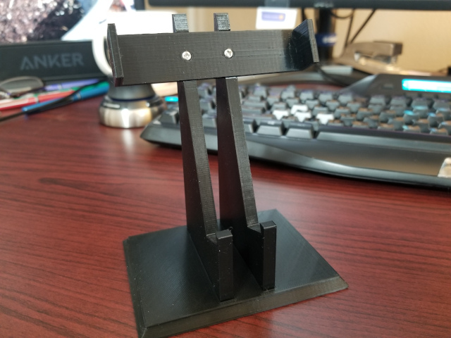

# Phone Stand
 A 3D-printed phone stand to hold a smartphone.

I wanted a simple phone stand for my desk that was trust-worthy and easy to use.  This solution offers several benefits:

- Only two touching points on the bottom allow cables to be plugged in.
- Horizontal arms allow for free movement.  This is a stand, not a phone mount.
- This design allows you to plop the phone in the stand without needing to be precise.
- There are no negotiations that have to be made to remove the phone from the stand.  Just pick it up.
- Parts all print flat, so there are no supports required. [Slicer plating](../blob/master/Pics/Slicer_plating.png)
- Parts are held together with M2.5x6 sheet metal screws. [link to Amazon](https://www.amazon.com/uxcell-100pcs-Stainless-Phillips-Tapping/dp/B01L7PDGXO/ref=sr_1_1?keywords=B01L7PDGXO&qid=1580227662&sr=8-1)
- A clean, classic design.

Sketchup and .stl files are provided in the SKP_STL folder. 
